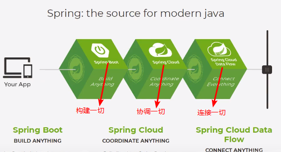

1.Spring

### 1.1、简介

- Spring：春天---> 给软件行业带来了春天
- 2002年，Rod Jahnson首次推出了Spring框架雏形interface21框架。
- 2004年3月24日，Spring框架以interface21框架为基础，经过重新设计，发布了1.0正式版。
- 很难想象Rod Johnson的学历 , 他是悉尼大学的博士，然而他的专业不是计算机，而是音乐学。
- Spring理念 : 使现有技术更加实用 . 本身就是一个大杂烩 , 整合现有的框架技术


- SSH : Struct2 + Spring + Hibernate!
- SSM : SpringMvc + Spring + Mybatis!


- 官网 : http://spring.io/
- 官方下载地址 : https://repo.spring.io/libs-release-local/org/springframework/spring/
- GitHub : https://github.com/spring-projects


```xml
<!-- https://mvnrepository.com/artifact/org.springframework/spring-webmvc -->
<dependency>
    <groupId>org.springframework</groupId>
    <artifactId>spring-webmvc</artifactId>
    <version>5.2.7.RELEASE</version>
</dependency>

<!-- https://mvnrepository.com/artifact/org.springframework/spring-jdbc -->
<dependency>
    <groupId>org.springframework</groupId>
    <artifactId>spring-jdbc</artifactId>
    <version>5.2.7.RELEASE</version>
</dependency>
```


### 1.2、优点

- Spring是一个开源免费的框架 , 容器 
- Spring是一个轻量级的框架 , 非侵入式的 .
- **控制反转 IoC  , 面向切面 Aop**
- 对事物的支持 , 对框架的支持


**总结一句话：Spring是一个轻量级的控制反转(IoC)和面向切面(AOP)的容器（框架）。**


### 1.3、组成


- **核心容器**：核心容器提供 Spring 框架的基本功能。核心容器的主要组件是 BeanFactory，它是工厂模式的实现。BeanFactory 使用*控制反转*（IOC） 模式将应用程序的配置和依赖性规范与实际的应用程序代码分开。
- **Spring 上下文**：Spring 上下文是一个配置文件，向 Spring 框架提供上下文信息。Spring 上下文包括企业服务，例如 JNDI、EJB、电子邮件、国际化、校验和调度功能。
- **Spring AOP**：通过配置管理特性，Spring AOP 模块直接将面向切面的编程功能 , 集成到了 Spring 框架中。所以，可以很容易地使 Spring 框架管理任何支持 AOP的对象。Spring AOP 模块为基于 Spring 的应用程序中的对象提供了事务管理服务。通过使用 Spring AOP，不用依赖组件，就可以将声明性事务管理集成到应用程序中。
- **Spring DAO**：JDBC DAO 抽象层提供了有意义的异常层次结构，可用该结构来管理异常处理和不同数据库供应商抛出的错误消息。异常层次结构简化了错误处理，并且极大地降低了需要编写的异常代码数量（例如打开和关闭连接）。Spring DAO 的面向 JDBC 的异常遵从通用的 DAO 异常层次结构。
- **Spring ORM**：Spring 框架插入了若干个 ORM 框架，从而提供了 ORM 的对象关系工具，其中包括 JDO、Hibernate 和 iBatis SQL Map。所有这些都遵从 Spring 的通用事务和 DAO 异常层次结构。
- **Spring Web 模块**：Web 上下文模块建立在应用程序上下文模块之上，为基于 Web 的应用程序提供了上下文。所以，Spring 框架支持与 Jakarta Struts 的集成。Web 模块还简化了处理多部分请求以及将请求参数绑定到域对象的工作。
- **Spring MVC 框架**：MVC 框架是一个全功能的构建 Web 应用程序的 MVC 实现。通过策略接口，MVC 框架变成为高度可配置的，MVC 容纳了大量视图技术，其中包括 JSP、Velocity、Tiles、iText 和 POI。

### 1.4、拓展

在Spring的官网有这个介绍：现代化的java开发！说白就是基于Spring的开发！




- Spring Boot
  - 一个快速开发的脚手架
  - 基于SpringBoot可以快速开发单个微服务
  - 约定大于配置！
- Spring Cloud
  - Spring CLoud是基于SpringBoot实现的


因为现在大所述公司都在使用SpringBoot进行快速开发，学习SpringBoot的前提，需要完全掌握Spring及SpringMVC！承上启下的作用


**弊端：发展太久了之后，违背了原来的理念！配置十分繁琐，人称：“配置地狱”！**


## 2、IOC理论推导

### 2.1、IoC基础

1.UserDao接口

2.UserDaoImpl实现类

3.UserService业务接口

4.UserServiceImpl业务实现类


在我们之前的业务中，用户的需求可能会影响我们原来的代码，我们需要更具用户的需求去修改源代码！如果程序代码量十分大，修改一次的成本代价十分昂贵！


我们使用一个Set接口实现，已经发生了革命性的变化！

```java
 private UserDao userDao;

// 利用set进行动态实现值的注入
public void setUserDao(UserDao userDao) {
    this.userDao = userDao;
}
```


- 之前，程序是主动创建对象！控制权在程序员手上！
- 使用了set注入之后，程序不再有主动性，而是变成了被动的接受对象！


这种思想从本质上实现了问题，我们程序员不用再去管理对象的创建了。系统的耦合性大大降低，可以更加专注的在业务的实现上！这是IOC的原型！


### 2.2、IOC本质

**控制反转IoC(Inversion of Control)，是一种设计思想，DI(依赖注入)是实现IoC的一种方法**，也有人认为DI只是IoC的另一种说法。没有IoC的程序中 , 我们使用面向对象编程 , 对象的创建与对象间的依赖关系完全硬编码在程序中，对象的创建由程序自己控制，控制反转后将对象的创建转移给第三方，个人认为所谓控制反转就是：获得依赖对象的方式反转了。


采用XML方式配置Bean的时候，Bean的定义信息是和实现分离的，而采用注解的方式可以把两者合为一体，Bean的定义信息直接以注解的形式定义在实现类中，从而达到了零配置的目的。


**控制反转是一种通过描述（XML或注解）并通过第三方去生产或获取特定对象的方式。在Spring中实现控制反转的是IoC容器，其实现方法是依赖注入（Dependency Injection,DI）。**


## 3、HelloSpring

**导入Jar包**

注 : spring 需要导入commons-logging进行日志记录 . 我们利用maven , 他会自动下载对应的依赖项 .

```xml
<dependency>
    <groupId>org.springframework</groupId>
    <artifactId>spring-webmvc</artifactId>
    <version>5.2.7.RELEASE</version>
</dependency>
```

**编写代码**

1、编写一个Hello实体类

```java

public class Hello {
    private String str;

    public String getStr() {
        return str;
    }

    public void setStr(String str) {
        this.str = str;
    }

    @Override
    public String toString() {
        return "Hello{" +
                "str='" + str + '\'' +
                '}';
    }
}
```

2、编写我们的spring文件 , 这里我们命名为beans.xml

```xml
<?xml version="1.0" encoding="UTF-8"?>
<beans xmlns="http://www.springframework.org/schema/beans"
       xmlns:xsi="http://www.w3.org/2001/XMLSchema-instance"
       xsi:schemaLocation="http://www.springframework.org/schema/beans
       http://www.springframework.org/schema/beans/spring-beans.xsd">

    <!--bean就是java对象 , 由Spring创建和管理

    类型 变量名 = new 类型();
    Hello hello = new Hello();
    bean = 对象   new Hello();
    id = 变量名
    class = new的对象
    property 相当于给对象中的属性设置一个变量
    -->
    <bean id="hello" class="nuc.ss.pojo.Hello">
        <property name="str" value="Spring"/>
    </bean>

</beans>
```

3、我们可以去进行测试了 .

```java
public class MyTest {
    public static void main(String[] args) {
        // 获取Spring的上下文对象
        ApplicationContext context = new ClassPathXmlApplicationContext("beans.xml");
        //我们的对象现在都在Spring中管理了，我们要使用，直接去里面取出来就可以
        Hello hello = (Hello)context.getBean("hello");
        System.out.println(hello);
    }
}
```


**思考问题？**

- Hello 对象是谁创建的 ?  
- hello 对象是由Spring创建的
- Hello 对象的属性是怎么设置的 ?  
- hello 对象的属性是由Spring容器设置的

这个过程就叫控制反转 :

- 控制 : 谁来控制对象的创建 , 传统应用程序的对象是由程序本身控制创建的 , 使用Spring后 , 对象是由Spring来创建的
- 反转 : 程序本身不创建对象 , 而变成被动的接收对象 
- 依赖注入 : 就是利用set方法来进行注入的.

 IOC是一种编程思想，由主动的编程变成被动的接收

可以通过new ClassPathXmlApplicationContext去浏览一下底层源码 


**OK , 到了现在 , 我们彻底不用再程序中去改动了 , 要实现不同的操作 , 只需要在xml配置文件中进行修改 , 所谓的IoC,一句话搞定 : 对象由Spring 来创建 , 管理 , 装配 ! **


## 4、IOC创建对象的方式

1.使用无参构造创建对象，默认！

```xml
<!--无参构造器-->
<bean id="user" class="nuc.ss.pojo.User">
    <property name="name" value="狂神"/>
</bean>
```

2.假设我们要使用有参构造创建对象。

1. 下标赋值

   ```xml
   <!--有参构造器1，下标赋值-->
   <bean id="user" class="nuc.ss.pojo.User">
       <constructor-arg index="0" value="狂神说Java"/>
   </bean>
   ```

2. 类型

   ```xml
   <!--有参构造器2，类型，但同类型只能一个，不建议使用-->
   <bean id="user" class="nuc.ss.pojo.User">
       <constructor-arg type="java.lang.String" value="狂神"/>
   </bean>
   ```

3. 参数名

   ```xml
   <!--有参构造器3，参数名-->
   <bean id="user" class="nuc.ss.pojo.User">
       <constructor-arg name="name" value="狂神"/>
   </bean>
   ```

总结：在配置文件加载的时候。其中管理的对象都已经初始化了！


## 5、Spring配置

### 5.1、别名

```xml
<!--别名，如果添加了别名也可以使用别名获取到这个对象-->
<alias name="user" alias="userNew"/>
```

### 5.2、Bean的配置

```xml
<!--
        id:bean的唯一标识符，也就是相当于我们学的对象名
        class：bean 对象所对应的权限定名：包名 + 类型
        name: 也是别名,而且name更高级，可以起多个别名，通过逗号空格分号等分割
-->
<bean id="userT" class="nuc.ss.pojo.UserT" name="userT2,t2">
    <property name="name" value="西部开源"/>
</bean>
```

### 5.3、import

团队的合作通过import来实现 ,可以将多个配置文件，导入合并为一个

假设，现在项目中有多个人开发，这三个人复制不同的类开发，不同的类需要不同的bean中，我们可以利用import将所有人的beans.xml合并为一个总的

- 张三 beans.xml
- 李四 beans2.xml
- 王五 beans3.xml
- applicationContext

```xml
<import resource="beans.xml"/>
<import resource="beans2.xml"/>
<import resource="beans3.xml"/>
```

使用的时候，直接使用总的配置就可以了


## 6、依赖注入

### 6.1、构造器注入

前面已经说过了

### 6.2、set方式注入【重点】

- 依赖注入（Dependency Injection,DI）。
  - 依赖 : 指Bean对象的创建依赖于容器 . Bean对象的依赖资源 .
  - 注入 : 指Bean对象所依赖的资源 , 由容器来设置和装配 .

【环境搭建】

1. 复杂类型 Address.java

   ```java
   public class Address {
       private String address;
   
       public String getAddress() {
           return address;
       }
   
       public void setAddress(String address) {
           this.address = address;
       }
       @Override
       public String toString() {
           return "Address{" +
                   "address='" + address + '\'' +
                   '}';
       }
   }
   ```

   

2. 真实测试对象 Student.java

   ```java
   public class Student {
       private String name;
       private Address address;
       private String[] books;
       private List<String> hobbies;
       private Map<String,String> card;
       private Set<String> games;
       private String wife;
       private Properties info;
   
       public String getName() {
           return name;
       }
   
       public void setName(String name) {
           this.name = name;
       }
   
       public Address getAddress() {
           return address;
       }
   
       public void setAddress(Address address) {
           this.address = address;
       }
   
       public String[] getBooks() {
           return books;
       }
   
       public void setBooks(String[] books) {
           this.books = books;
       }
   
       public List<String> getHobbies() {
           return hobbies;
       }
   
       public void setHobbies(List<String> hobbies) {
           this.hobbies = hobbies;
       }
   
       public Map<String, String> getCard() {
           return card;
       }
   
       public void setCard(Map<String, String> card) {
           this.card = card;
       }
   
       public Set<String> getGames() {
           return games;
       }
   
       public void setGames(Set<String> games) {
           this.games = games;
       }
   
       public String getWife() {
           return wife;
       }
   
       public void setWife(String wife) {
           this.wife = wife;
       }
   
       public Properties getInfo() {
           return info;
       }
   
       public void setInfo(Properties info) {
           this.info = info;
       }
   
       @Override
       public String toString() {
           return "Student{" +
                   "name='" + name + '\'' +
                   ", address=" + address.toString +
                   ", books=" + Arrays.toString(books) +
                   ", hobbies=" + hobbies +
                   ", card=" + card +
                   ", games=" + games +
                   ", wife='" + wife + '\'' +
                   ", info=" + info +
                   '}';
       }
   }
   ```

3. beans.xml

   ```xml
   <?xml version="1.0" encoding="UTF-8"?>
   <beans xmlns="http://www.springframework.org/schema/beans"
          xmlns:xsi="http://www.w3.org/2001/XMLSchema-instance"
          xsi:schemaLocation="http://www.springframework.org/schema/beans http://www.springframework.org/schema/beans/spring-beans.xsd">
   
       <bean id="address" class="nuc.ss.pojo.Address">
           <property name="address" value="西安"/>
       </bean>
   
       <bean id="student" class="nuc.ss.pojo.Student">
           <!--第一种，普通值注入 value-->
           <property name="name" value="狂神"/>
   
           <!--第二种： Bean注入 ref-->
           <property name="address" ref="address"/>
   
           <!--第三种： 数组注入 -->
           <property name="books">
               <array>
                   <value>红楼梦</value>
                   <value>西游记</value>
                   <value>水浒传</value>
                   <value>三国演义</value>
               </array>
           </property>
   
           <!--第四种：list注入-->
           <property name="hobbies">
               <list>
                   <value>听歌</value>
                   <value>敲代码</value>
                   <value>看电影</value>
               </list>
           </property>
   
           <!--第五种：map注入-->
           <property name="card">
               <map>
                   <entry key="身份证" value="111111111111111111"/>
                   <entry key="银行卡" value="22222222222222222222"/>
               </map>
           </property>
   
           <!--第六种：set注入-->
           <property name="games">
               <set>
                   <value>LOL</value>
                   <value>COC</value>
                   <value>BOB</value>
               </set>
           </property>
   
           <!--第七种：null注入-->
           <property name="wife">
               <null/>
           </property>
   
           <!--第七种：Properties注入-->
           <property name="info">
               <props>
                   <prop key="driver">com.mysql.jdbc.Driver</prop>
                   <prop key="url">localhost://3306</prop>
                   <prop key="username">root</prop>
                   <prop key="password">admin</prop>
               </props>
           </property>
       </bean>
   </beans>
   ```

4. 测试类

   ```java
   public class MyTest {
       public static void main(String[] args) {
           ApplicationContext context = new ClassPathXmlApplicationContext("beans.xml");
           Student student = (Student)context.getBean("student");
           System.out.println(student);
       }
   }
   ```

   

### 6.3、拓展方式注入

我们可以使用p命令空间和c命令空间进行注入

官方解释：


使用！

```xml
<?xml version="1.0" encoding="UTF-8"?>
<beans xmlns="http://www.springframework.org/schema/beans"
       xmlns:xsi="http://www.w3.org/2001/XMLSchema-instance"
       xmlns:p="http://www.springframework.org/schema/p"
       xmlns:c="http://www.springframework.org/schema/c"
       xsi:schemaLocation="http://www.springframework.org/schema/beans http://www.springframework.org/schema/beans/spring-beans.xsd">

    <!--p命名空间可以直接注入属性的值 property-->
    <bean id="user" class="nuc.ss.pojo.User" p:name="狂神" p:age="18"/>

    <!--c命名空间可以通过构造器注入 construct-args-->
    <bean id="user" class="nuc.ss.pojo.User" c:age="18" c:name="狂神2"/>
</beans>
```

测试：

```java
@Test
public void test2() {
    ApplicationContext context = new ClassPathXmlApplicationContext("userBeans.xml");
    //User user = (User)context.getBean("user");
    User user = context.getBean("user", User.class);
    System.out.println(user);
}
```

注意点：p命名和c命名空间不能直接使用，需要引入xml约束!

```xml
xmlns:p="http://www.springframework.org/schema/p"
xmlns:c="http://www.springframework.org/schema/c"
```


### 6.4、Bean的作用域


1. 单例模式(Spring默认机制)

   ```xml
   <bean id="user" class="nuc.ss.pojo.User" scope="singleton"/>
   ```

2. 原型模式：每次从容器中get的时候，都会产生一个现对象！

   ```xml
   <bean id="user" class="nuc.ss.pojo.User" scope="prototype"/>
   ```

3. 其余的request、session、application这些个只能在web开发中使用到

## 7、Bean的自动装配

- 自动装配是Spring满足bean依赖的一种方式
- Spring会在上下文自动寻找，并自动给bean装配属性！


在Spring中有三种自动装配的方式

1. 在xml中显示的配置
2. 在java中显示配置
3. 隐式的自动装配bean【重要】

这里我们主要讲第三种：自动化的装配bean。

### 7.1、测试

环境搭建：一个人有两个宠物


### 7.2、ByName自动装配

```xml
<bean id="cat" class="nuc.ss.pojo.Cat"/>
<bean id="dog" class="nuc.ss.pojo.Dog"/>
<!--
    byName:会自动在容器上下文中套接，和自己对象的set方法后面的值相对应的beanid
-->
<bean id="people" class="nuc.ss.pojo.People" autowire="byName">
    <property name="name" value="狂神"/>
</bean>
```

### 7.3、ByType自动装配

```xml
<bean id="cat" class="nuc.ss.pojo.Cat"/>
<bean id="dog" class="nuc.ss.pojo.Dog"/>
<!--
    byType:会自动在容器上下文中套接，和自己对象属性类型相同的beanid
-->
<bean id="people" class="nuc.ss.pojo.People" autowire="byType">
    <property name="name" value="狂神"/>
</bean>
```

小结：

- byname的时候，需要保证所有bean的id唯一，并且这个bean需要和自动注入的属性的set方法的值一致
- bytype的时候，需要保证所有bean的class唯一，并且这个bean需要和自动注入的属性的类型一致

### 7.4、使用注解实现自动装配

jdk1.5支持的注解，Spring2.5就支持注解了！

The introduction of annotation-based configuration raised the question of whether this approach is “better” than XML. 

要使用注解需知：

1. 导入约束：context支持

2. 配置注解的支持：<context:annotation-config/>

   ```xml
   <?xml version="1.0" encoding="UTF-8"?>
   <beans xmlns="http://www.springframework.org/schema/beans"
       xmlns:xsi="http://www.w3.org/2001/XMLSchema-instance"
       xmlns:context="http://www.springframework.org/schema/context"
       xsi:schemaLocation="http://www.springframework.org/schema/beans
           https://www.springframework.org/schema/beans/spring-beans.xsd
           http://www.springframework.org/schema/context
           https://www.springframework.org/schema/context/spring-context.xsd">
   
       <context:annotation-config/>
   
   </beans>
   ```

   #### @Autowired注解

   - 需要导入 spring-aop的包！

   - 直接在属性上使用即可！也可以在set方式上使用！

   - 使用Autowired我们可以不用编写set方法，前提是你这个自动装配的属性在IOC（Spring）容器中存在，且符合名字byName和类型byType！

     - 正常1（byName）

       ```xml
       <bean id="cat" class="nuc.ss.pojo.Cat"/>
       <bean id="dog" class="nuc.ss.pojo.Dog"/>
       
       <bean id="people" class="nuc.ss.pojo.People"/>
       ```

     - 正常2（byType）

       ```xml
       <bean id="cat111" class="nuc.ss.pojo.Cat"/>
       <bean id="dog222" class="nuc.ss.pojo.Dog"/>
       
       <bean id="people" class="nuc.ss.pojo.People"/>
       ```

     - 正常3（混合使用，先类型后名字）

       ```xml
       <bean id="cat11" class="nuc.ss.pojo.Cat"/>
       <bean id="cat" class="nuc.ss.pojo.Cat"/>
       <bean id="dog222" class="nuc.ss.pojo.Dog"/>
       
       <bean id="people" class="nuc.ss.pojo.People"/>
       ```

     - 不正常（多种类型且名字也不匹配，报错）

       ```xml
       <bean id="cat11" class="nuc.ss.pojo.Cat"/>
       <bean id="cat111" class="nuc.ss.pojo.Cat"/>
       <bean id="dog22" class="nuc.ss.pojo.Dog"/>
       <bean id="dog222" class="nuc.ss.pojo.Dog"/>
       
       <bean id="people" class="nuc.ss.pojo.People"/>
       ```

   - 科普：

     ```xm
     @Nullable 字段标记了这个注解，说明这个字段可以为null
     ```

     ```java
     public @interface Autowired {
         boolean required() default true;
     }
     ```

   - 测试代码

     ```java
     public class People {
         //如果显示的定义了Autowired的required属性为false，说明这个对象可以为null，否则不允许为空
         @Autowired(required = false)
         private Cat cat;
         @Autowired
         private Dog dog;
         private String name;
     }
     ```

   - 如果@Autowired自动装配的环境比较复杂，自动装配无法通过一个注解【@Autowired】完成的时候，我们可以使用@Qualifilter(value="xxx")去配合@Autowired的使用，指定一个唯一的bean对象注入

     ```java
     public class People {
         @Autowired
         @Qualifier(value = "cat11")
         private Cat cat;
         @Autowired
         @Qualifier(value="dog222")
         private Dog dog;
         private String name;
     }
     ```

   #### Resource注解

   ```java
   public class People {
       @Resource(name = "cat1")
       private Cat cat;
       @Resource
       private Dog dog;
       private String name;
   }
   ```

   小结：

   @Resource和@Autowired

   - 都是用来自动装配的，都可以放在属性字段上
   - 实现方式不同
     - @Autowired默认通过bytype的方式实现，如果有多个类型，则通过byname实现，如果两个都找不到，就报错！
     - @Resource默认通过byname的方式实现，如果找不到名字，则通过bytype实现，如果两个都找不到，就报错！
   - 执行的顺序不同：
     - @Autowired默认通过bytype的方式实现
     - @Resource默认通过byname的方式实现
   - 类型重复的话，如果名字不是默认的（如cat11，cat111，而没有默认的cat）
     - @Autowired配合@Qualifier(value = "cat11")使用
     - @Resource直接使用@Resource(name = "cat11")

## 8.使用注解开发

在Spring4之后，要使用注解开发，必须要保证aop的包导入了


使用注解需要导入context约束，增加注解的支持！

```xml
<?xml version="1.0" encoding="UTF-8"?>
<beans xmlns="http://www.springframework.org/schema/beans"
    xmlns:xsi="http://www.w3.org/2001/XMLSchema-instance"
    xmlns:context="http://www.springframework.org/schema/context"
    xsi:schemaLocation="http://www.springframework.org/schema/beans
        https://www.springframework.org/schema/beans/spring-beans.xsd
        http://www.springframework.org/schema/context
        https://www.springframework.org/schema/context/spring-context.xsd">

    <context:annotation-config/>

</beans>
```

1. bean

   ```java
   // 等价于 <bean id="user" class="nuc.ss.pojo.User"/>
   @Component
   ```

2. 属性如何注入@Value("xxx")

   ```java
   @Component
   public class User {
       //相当于<property name="name" value="狂神"/>
       @Value("狂神")
       public String name;
   }
   ```

3. 衍生的注解

   @Component有几个衍生的注解，我们在web开发中，会按照mvc三层架构分层！

   - dao【@Repository】

   - service 【@Service】

   - controller 【@Controller】

     这四个注解功能都是一样的，都是代表将某个注册类注入到Spring中，装配Bean

4. 自动装配置

   - @Autowired：自动装配通过类型、名字
     - 如果Autowired不能唯一自动装配上属性，则需要通过@Qualifilter(value="xxx")
   - @Nullable：字段标记了这个注解，说明这个字段可以为null
   - @Resource：自动装配通过名字、类型 

5. 作用域 @Scope

   ```java
   @Component
   @Scope("singleton")
   public class User {
       public String name;
   
       //相当于<property name="name" value="狂神"/>
       @Value("狂神")
       public void setName(String name) {
           this.name = name;
       }
   }
   ```

   

6. 小结

   xml与注解

   - xml更加万能，适用于任何场合！维护简单方便
   - 注解不是自己的类用不了，维护相对复杂

   xml与注解的最佳实践：

   - xml用来管理bean;

   - 注解只负责完成属性的注入;

   - 我们在使用的过程中，只需要注意一个问题：必须让注解生效，就需要开启注解支持

     ```xml
     <!--指定要扫描的包，这个包下面的注解就会生效-->
     <context:component-scan base-package="nuc.ss"/>
     <context:annotation-config/>
     ```

     

## 9.使用java的方式配置Spring

我们现在要完全不适用Spring的xml配置了，全权交给java来做

javaConfig是Spring的一个子项目，在Spring4之后，它成为了一个核心功能！


实体类


```java

//这里这个注解的意思，就是说明这个类被Spring接管了。注解到了容器中
@Component
public class User {
    private String name;

    public String getName() {
        return name;
    }

    //属性注入值
    @Value("狂神")
    public void setName(String name) {
        this.name = name;
    }

    @Override
    public String toString() {
        return "User{" +
                "name='" + name + '\'' +
                '}';
    }
}

```

配置文件

```java
//这个也被Spring容器托管，注册到容器里，因为他本来就是一个@Component，
// @Component代表这是一个配置类，就和我们之前看的beans.xml是一样的
@Configuration
@ComponentScan("nuc.ss.pojo")
@Import(MyConfig2.class)
public class MyConfig {

    //注册一个bean，就相当于我们之前写的一个bean标签，
    //这个方法的名字就相当于bean标签的id属性
    //这个方法的返回值,就相当于bean标签中的class属性
    @Bean
    public User getUser() {
        return new User();//就是要返回注入到bean的对象!
    }
}
```

测试类！

```java
@Test
public void test1() {
    // 如果完全使用了配置类的方式去做,我们就只能通过AnnotationConfig 上下文来获取容器,通过配置类的class对象加载!
    ApplicationContext context = new AnnotationConfigApplicationContext(MyConfig.class);

    User getUser = context.getBean("getUser", User.class);

    System.out.println(getUser.getName());
}
```

这种纯java的配置方式，在SpringBoot中随处可见！


## 10、代理模式

为什么要学习代理模式？因为这就是SpringAOP的底层！【SpringAOP和SpringMVC】

代理模式的分类：

- 静态代理
- 动态代理


### 10.1、静态代理

角色分析：

- 抽象角色：一般会使用接口或者抽象类来解决
- 真实角色：被代理的角色
- 代理角色：代理真实角色，代理真实角色后，我们一般会做一些附属操作
- 客户：访问代理对象的人！


代码步骤：

1. 接口

   ```java
   public interface Rent {
       public void rent();
   }
   ```

2. 真实角色

   ```java
   //房东
   public class Host implements Rent {
   
       public void rent() {
           System.out.println("房东要出租房子");
       }
   }
   ```

3. 代理角色

   ```java
   public class Proxy implements Rent {
       private Host host;
   
       public Proxy() {
       }
   
       public Proxy(Host host) {
           this.host = host;
       }
   
       public void rent() {
           seeHouse();
           fare();
           contract();
           host.rent();
       }
   
       //看房
       public void seeHouse() {
           System.out.println("中介带你看房");
       }
   
       //收中介费
       public void fare() {
           System.out.println("收中介费");
       }
   
       //收中介费
       public void contract() {
           System.out.println("签租赁合同");
       }
   }
   ```

4. 客户端访问代理角色

   ```java
   public class Client {
       public static void main(String[] args) {
           //房东要租房子
           Host host = new Host();
           //代理，中介帮房东租房子，但是代理一般会有一些附属操作
           Proxy proxy = new Proxy(host);
   
           //你不用面对房东，直接面对中介
           proxy.rent();
       }
   }
   ```

   


静态代理模式的好处：

- 可以使真实角色的操作更加纯粹！不用去关注一些公共的业务
- 公共也就交给代理角色！实现了业务的分工！
- 公共业务发生扩展的时候，方便集中管理！

缺点：

- 一个真实角色就会产生一个代理角色；
- 代码量会翻倍-开发效率会变低


### 10.2 、加深理解

代码：

1. 接口

   ```java
   public interface UserService {
       public void add();
       public void delete();
       public void update();
       public void query();
   }
   
   ```

2. 真实角色：改动原有的业务代码，在公司中是大忌！

   ```java
   //真实对象
   public class UserServiceImpl implements UserService {
       public void add() {
           System.out.println("增加了一个用户");
       }
   
       public void delete() {
           System.out.println("删除了一个用户");
       }
   
       public void update() {
           System.out.println("修改了一个用户");
       }
   
       public void query() {
           System.out.println("查询了一个用户");
       }
   }
   ```

3. 需求来了，现在我们需要增加一个日志功能，怎么实现！

   - 思路1 ：在实现类上增加代码 【麻烦！】
   - 思路2：使用代理来做，能够不改变原来的业务情况下，实现此功能就是最好的了！

4. 设置一个代理类来处理日志！代理角色

   ```java
   public class UserServiceProxy implements UserService {
       private UserService userService;
   
       public void setUserService(UserService userService) {
           this.userService = userService;
       }
   
       public void add() {
           log("add");
           userService.add();
       }
   
       public void delete() {
           log("delete");
           userService.delete();
       }
   
       public void update() {
           log("update");
           userService.update();
       }
   
       public void query() {
           log("query");
           userService.query();
       }
   
       //日志方法
       private void log(String msg) {
           System.out.println("使用了" + msg + "方法");
       }
   }
   ```

5. 客户端访问代理角色

   ```java
   public class Client {
       public static void main(String[] args) {
           UserService userService = new UserServiceImpl();
   
           UserServiceProxy proxy = new UserServiceProxy();
           proxy.setUserService(userService);
   
           proxy.add();
       }
   }
   ```

**我们在不改变原来的代码的情况下，实现了对原有功能的增强，这是AOP中最核心的思想**

聊聊AOP：纵向开发，横向开发


### 10.3、动态代理

- 动态代理和静态代理角色一样
- 动态代理的代理类是动态生成的，不是 我们直接写好的！
- 动态代理分为两大类：基于接口的动态代理、基于类的动态代理
  - 基于接口：JDK动态代理【我们在这里使用】
  - 基于类：cglib
  - java字节码实现：javasist

需要了解两个类：Proxy：代理，InvocationHandler：调用处理程序


动态代理的好处：

- 可以使真实角色的操作更加纯粹！不用去关注一些公共的业务
- 公共也就交给代理角色！实现了业务的分工！
- 公共业务发生扩展的时候，方便集中管理！
- 一个动态代理类代理的是一个接口，一般就是对应的一类业务
- 一个动态代理类可以代理多个类，只要是实现了同一个接口即可【核心】


## 11、AOP

### 11.1、什么是AOP

AOP（Aspect Oriented Programming）意为：面向切面编程，通过预编译方式和运行期动态代理实现程序功能的统一维护的一种技术。AOP是OOP的延续，是软件开发中的一个热点，也是Spring框架中的一个重要内容，是函数式编程的一种衍生范型。利用AOP可以对业务逻辑的各个部分进行隔离，从而使得业务逻辑各部分之间的耦合度降低，提高程序的可重用性，同时提高了开发的效率。


 

### 11.2、Aop在Spring中的作用

**提供声明式事务；允许用户自定义切面**

以下名词需要了解下：

- 横切关注点：跨越应用程序多个模块的方法或功能。即是，与我们业务逻辑无关的，但是我们需要关注的部分，就是横切关注点。如日志 , 安全 , 缓存 , 事务等等 ....
- 切面（ASPECT）：横切关注点 被模块化 的特殊对象。即，它是一个类。<font color=red>Log</font>
- 通知（Advice）：切面必须要完成的工作。即，它是类中的一个方法。<font color=red>Log方法</font>
- 目标（Target）：被通知对象。<font color=red>接口</font>
- 代理（Proxy）：向目标对象应用通知之后创建的对象。<font color=red>代理类</font>
- 切入点（PointCut）：切面通知 执行的 “地点”的定义。<font color=red>method</font>
- 连接点（JointPoint）：与切入点匹配的执行点。<font color=red>invoke</font>


SpringAOP中，通过Advice定义横切逻辑，Spring中支持5种类型的Advice:

|   通知类型   |        连接点        |                    实现接口                     |
| :----------: | :------------------: | :---------------------------------------------: |
|   前置通知   |        方法前        |   org.springframework.aop.MethodBeforeAdvice    |
|   后置通知   |        方法后        |  org.springframework.aop.AfterReturningAdvice   |
|   环绕通知   |       方法前后       |   org.aopalliance.intercept.MethodInterceptor   |
| 异常抛出通知 |     方法抛出异常     |      org.springframework.aop.ThrowsAdvice       |
|   引介通知   | 类中增加新的方法属性 | org.springframework.aop.IntroductionInterceptor |

即 Aop 在 不改变原有代码的情况下 , 去增加新的功能 .


### 11.3、使用Spring实现Aop

【重点】使用AOP织入，需要导入一个依赖包！

```xml
<!-- https://mvnrepository.com/artifact/org.aspectj/aspectjweaver --><dependency>   
    <groupId>org.aspectj</groupId>
    <artifactId>aspectjweaver</artifactId>
    <version>1.9.4</version>
</dependency>
```


方式一：使用Spring的API接口【主要SpringAPI接口实现】

1. 首先编写我们的业务接口和实现类

   ```java
   public interface UserService {
   
      public void add();
   
      public void delete();
   
      public void update();
   
      public void select();
   
   }
   ```

   ```java
   public class UserServiceImpl implements UserService{
   
      @Override
      public void add() {
          System.out.println("增加用户");
     }
   
      @Override
      public void delete() {
          System.out.println("删除用户");
     }
   
      @Override
      public void update() {
          System.out.println("更新用户");
     }
   
      @Override
      public void select() {
          System.out.println("查询用户");
     }
   }
   ```

2. 写我们的增强类 , 我们编写两个 , 一个前置增强 一个后置增强

   ```java
   public class Log implements MethodBeforeAdvice {
   
      //method : 要执行的目标对象的方法
      //objects : 被调用的方法的参数
      //Object : 目标对象
      @Override
      public void before(Method method, Object[] objects, Object o) throws Throwable {
          System.out.println( o.getClass().getName() + "的" + method.getName() + "方法被执行了");
     }
   }
   ```

   ```java
   public class AfterLog implements AfterReturningAdvice {
      //returnValue 返回值
      //method被调用的方法
      //args 被调用的方法的对象的参数
      //target 被调用的目标对象
      @Override
      public void afterReturning(Object returnValue, Method method, Object[] args, Object target) throws Throwable {
          System.out.println("执行了" + target.getClass().getName()
          +"的"+method.getName()+"方法,"
          +"返回值："+returnValue);
     }
   }
   ```

3. 在spring的文件中注册 , 并实现aop切入实现 , 注意导入约束 .

   ```xml
   <?xml version="1.0" encoding="UTF-8"?>
   <beans xmlns="http://www.springframework.org/schema/beans"
         xmlns:xsi="http://www.w3.org/2001/XMLSchema-instance"
         xmlns:aop="http://www.springframework.org/schema/aop"
         xsi:schemaLocation="http://www.springframework.org/schema/beans
          http://www.springframework.org/schema/beans/spring-beans.xsd
          http://www.springframework.org/schema/aop
          http://www.springframework.org/schema/aop/spring-aop.xsd">
   
      <!--注册bean-->
      <bean id="userService" class="nuc.ss.service.UserServiceImpl"/>
      <bean id="log" class="nuc.ss.log.Log"/>
      <bean id="afterLog" class="nuc.ss.log.AfterLog"/>
   
      <!--aop的配置-->
      <aop:config>
          <!--切入点 expression:表达式匹配要执行的方法-->
          <aop:pointcut id="pointcut" expression="execution(* nuc.ss.service.UserServiceImpl.*(..))"/>
          <!--执行环绕; advice-ref执行方法 . pointcut-ref切入点-->
          <aop:advisor advice-ref="log" pointcut-ref="pointcut"/>
          <aop:advisor advice-ref="afterLog" pointcut-ref="pointcut"/>
      </aop:config>
   
   </beans>
   ```

4. 测试

   ```java
   public class MyTest {
      @Test
      public void test(){
          ApplicationContext context = new ClassPathXmlApplicationContext("beans.xml");
          UserService userService = (UserService) context.getBean("userService");
          userService.select();
     }
   }
   ```

   

Aop的重要性 : 很重要 . 一定要理解其中的思路 , 主要是思想的理解这一块 .

**Spring的Aop就是将公共的业务 (日志 , 安全等) 和领域业务结合起来 , 当执行领域业务时 , 将会把公共业务加进来 . 实现公共业务的重复利用 . 领域业务更纯粹 , 程序猿专注领域业务 , 其本质还是动态代理 . **


方式二：自定义来实现【主要是切面定义】

目标业务类不变依旧是userServiceImpl

1. 写我们自己的一个切入类

   ```java
   public class DiyPointCut {
       public void before() {
           System.out.println("==========方法执行前============");
       }
   
       public void after() {
           System.out.println("==========方法执行后============");
       }
   }
   ```

2. 去spring中配置

   ```xml
   <!--方式二：自定义类-->
   <!--注册bean-->
   <bean id="diy" class="nuc.ss.diy.DiyPointCut"/>
   
   <!--aop的配置-->
   <aop:config>
       <!--自定义切面，ref要引用的类-->
       <aop:aspect ref="diy">
           <!--切入点-->
           <aop:pointcut id="point" expression="execution(* nuc.ss.service.UserServiceImpl.*(..))"/>
           <aop:before method="before" pointcut-ref="point"/>
           <aop:after method="after" pointcut-ref="point"/>
           <!--通知-->
       </aop:aspect>
   </aop:config>
   ```

3. 测试：

   ```java
   @Test
   public void test1() {
       ApplicationContext context = new ClassPathXmlApplicationContext("applicationContext.xml");
   
       UserService userService = (UserService)context.getBean("userService");
   
       userService.add();
   }
   ```

   

方式三：使用注解实现！

1. 编写一个注解实现的增强类

   ```java
   //方式三：使用注解的方式实现AOP
   @Aspect//标注这个类是一个切面
   public class AnnotationPointCut {
       @Before("execution(* nuc.ss.service.UserServiceImpl.*(..))")
       public void before() {
           System.out.println("==========方法执行前============");
       }
   
       @After("execution(* nuc.ss.service.UserServiceImpl.*(..))")
       public void after() {
           System.out.println("==========方法执行后============");
       }
   
       //在环绕增强中，我们可以给定一个参数，代表我们要获取处理切入的点
       @Around("execution(* nuc.ss.service.UserServiceImpl.*(..))")
       public void around(ProceedingJoinPoint jp) throws Throwable {
           System.out.println("==========环绕前============");
   
           //获取签名
           //Signature signature = jp.getSignature();
           //System.out.println("signature:" + signature);
   
           //执行方法
           Object proceed = jp.proceed();
   
           System.out.println("==========环绕后============");
       }
   }
   ```

2. 在Spring配置文件中，注册bean，并增加支持注解的配置

   ```xml
   <!--方式三：注解-->
   <bean id="annotationPointCut" class="nuc.ss.diy.AnnotationPointCut"/>
   <!--开启注解支持: JDK（默认proxy-target-class="false"） cglib-->
   <aop:aspectj-autoproxy proxy-target-class="true"/>
   ```

   

## 12、整合Mybatis

步骤：

1. 导入相关jar包

   - junit

     ```xml
     <dependency>
        <groupId>junit</groupId>
        <artifactId>junit</artifactId>
        <version>4.12</version>
     </dependency>
     ```

   - mybatis

     ```xml
     <dependency>
        <groupId>org.mybatis</groupId>
        <artifactId>mybatis</artifactId>
        <version>3.5.2</version>
     </dependency>
     ```

   - mysql数据库：mysql-connector-java

     ```xml
     <dependency>
        <groupId>mysql</groupId>
        <artifactId>mysql-connector-java</artifactId>
        <version>5.1.47</version>
     </dependency>
     ```

   - spring相关的：spring-webmvc

     ```xml
     <dependency>
        <groupId>org.springframework</groupId>
        <artifactId>spring-webmvc</artifactId>
        <version>5.1.10.RELEASE</version>
     </dependency>
     <dependency>
        <groupId>org.springframework</groupId>
        <artifactId>spring-jdbc</artifactId>
        <version>5.1.10.RELEASE</version>
     </dependency>
     ```

   - aspectJ AOP 织入器

     ```xml
     <dependency>
        <groupId>org.aspectj</groupId>
        <artifactId>aspectjweaver</artifactId>
        <version>1.9.4</version>
     </dependency>
     ```

   - mybatis-spring整合包【重点】

     ```xml
     <dependency>
        <groupId>org.mybatis</groupId>
        <artifactId>mybatis-spring</artifactId>
        <version>2.0.2</version>
     </dependecy>
     ```

   - 配置Maven静态资源过滤问题！

     ```xml
     <build>
        <resources>
            <resource>
                <directory>src/main/java</directory>
                <includes>
                    <include>**/*.properties</include>
                    <include>**/*.xml</include>
                </includes>
                <filtering>true</filtering>
            </resource>
        </resources>
     </build>
     ```

2. 编写配置文件

3. 测试


### 12.1、回忆mybatis

1. 编写实体类

   ```java
   package nuc.ss.pojo;
   
   public class User {
      private int id;
      private String name;
      private String pwd;
   }
   ```

2. 编写核心配置文件

   ```xml
   <?xml version="1.0" encoding="UTF-8" ?>
   <!DOCTYPE configuration
          PUBLIC "-//mybatis.org//DTD Config 3.0//EN"
          "http://mybatis.org/dtd/mybatis-3-config.dtd">
   <configuration>
   
      <typeAliases>
          <package name="nuc.ss.pojo"/>
      </typeAliases>
   
      <environments default="development">
          <environment id="development">
              <transactionManager type="JDBC"/>
              <dataSource type="POOLED">
                  <property name="driver" value="com.mysql.jdbc.Driver"/>
                  <property name="url" value="jdbc:mysql://localhost:3306/mybatis?useSSL=true&amp;useUnicode=true&amp;characterEncoding=utf8"/>
                  <property name="username" value="root"/>
                  <property name="password" value="admin"/>
              </dataSource>
          </environment>
      </environments>
   
      <mappers>
          <package name="nuc.ss.dao"/>
      </mappers>
   </configuration>
   ```

3. 编写接口

   ```java
   public interface UserMapper {
      public List<User> selectUser();
   }
   ```

4. 编写Mapper.xml

   ```xml
   <?xml version="1.0" encoding="UTF-8" ?>
   <!DOCTYPE mapper
          PUBLIC "-//mybatis.org//DTD Mapper 3.0//EN"
          "http://mybatis.org/dtd/mybatis-3-mapper.dtd">
   <mapper namespace="nuc.ss.dao.UserMapper">
      <select id="selectUser" resultType="User">
       select * from user
      </select>
   
   </mapper>
   ```

5. 测试

   ```java
   @Test
   public void selectUser() throws IOException {
   
      String resource = "mybatis-config.xml";
      InputStream inputStream = Resources.getResourceAsStream(resource);
      SqlSessionFactory sqlSessionFactory = new SqlSessionFactoryBuilder().build(inputStream);
      SqlSession sqlSession = sqlSessionFactory.openSession();
   
      UserMapper mapper = sqlSession.getMapper(UserMapper.class);
   
      List<User> userList = mapper.selectUser();
      for (User user: userList){
          System.out.println(user);
     }
   
      sqlSession.close();
   }
   ```

### 12.2、Mybatis-Spring

引入Spring之前需要了解mybatis-spring包中的一些重要类；

[mybatis-spring官网](http://www.mybatis.org/spring/zh/index.html)


**什么是 MyBatis-Spring？**

MyBatis-Spring 会帮助你将 MyBatis 代码无缝地整合到 Spring 中。

**知识基础**

在开始使用 MyBatis-Spring 之前，你需要先熟悉 Spring 和 MyBatis 这两个框架和有关它们的术语。这很重要

MyBatis-Spring 需要以下版本：

| MyBatis-Spring | MyBatis | Spring 框架 | Spring Batch |  Java   |
| :------------: | :-----: | :---------: | :----------: | :-----: |
|      2.0       |  3.5+   |    5.0+     |     4.0+     | Java 8+ |
|      1.3       |  3.4+   |   3.2.2+    |     2.1+     | Java 6+ |

如果使用 Maven 作为构建工具，仅需要在 pom.xml 中加入以下代码即可：

```xml
<dependency>
   <groupId>org.mybatis</groupId>
   <artifactId>mybatis-spring</artifactId>
   <version>2.0.2</version>
</dependency>
```

**整合方式一**

1. 引入配置文件

   ```xml
   <?xml version="1.0" encoding="UTF-8"?>
   <beans xmlns="http://www.springframework.org/schema/beans"
         xmlns:xsi="http://www.w3.org/2001/XMLSchema-instance"
         xsi:schemaLocation="http://www.springframework.org/schema/beans
          http://www.springframework.org/schema/beans/spring-beans.xsd">
   </beans>
   ```

2. 编写数据源配置

   ```xml
   <!--配置数据源：数据源有非常多，可以使用第三方的，也可使使用Spring的-->
   <bean id="dataSource" class="org.springframework.jdbc.datasource.DriverManagerDataSource">
      <property name="driverClassName" value="com.mysql.jdbc.Driver"/>
      <property name="url" value="jdbc:mysql://localhost:3306/mybatis?useSSL=true&amp;useUnicode=true&amp;characterEncoding=utf8"/>
      <property name="username" value="root"/>
      <property name="password" value="admin"/>
   </bean>
   ```

3. sqlSessionFactory

   ```xml
   <!--配置SqlSessionFactory-->
   <bean id="sqlSessionFactory" class="org.mybatis.spring.SqlSessionFactoryBean">
      <property name="dataSource" ref="dataSource"/>
      <!--关联Mybatis-->
      <property name="configLocation" value="classpath:mybatis-config.xml"/>
      <property name="mapperLocations" value="classpath:nuc/ss/dao/*.xml"/>
   </bean>
   ```

4. sqlSessionTemplate

   ```xml
   <!--注册sqlSessionTemplate , 关联sqlSessionFactory-->
   <bean id="sqlSession" class="org.mybatis.spring.SqlSessionTemplate">
      <!--利用构造器注入,没有set注入，只能使用构造器注入-->
      <constructor-arg index="0" ref="sqlSessionFactory"/>
   </bean>
   ```

5. 需要给接口加实现类【新加的】

   ```java
   public class UserDaoImpl implements UserMapper {
      //sqlSession不用我们自己创建了，Spring来管理
      private SqlSessionTemplate sqlSession;
   
      public void setSqlSession(SqlSessionTemplate sqlSession) {
          this.sqlSession = sqlSession;
     }
      public List<User> selectUser() {
          UserMapper mapper = sqlSession.getMapper(UserMapper.class);
          return mapper.selectUser();
     }
   }
   ```

6. 将自己写的实现类，注入到Spring中

   ```xml
   <bean id="userDao" class="nuc.ss.dao.UserDaoImpl">
      <property name="sqlSession" ref="sqlSession"/>
   </bean>
   ```

7. 测试使用即可

   ```java
   @Test
   public void test2(){
       ApplicationContext context = new ClassPathXmlApplicationContext("applicationContext.xml");
       UserMapper mapper = (UserMapper) context.getBean("userDao");
       List<User> user = mapper.selectUser();
       System.out.println(user);
   }
   ```

结果成功输出！现在我们的Mybatis配置文件的状态！发现都可以被Spring整合！

为了<font color=red>给mybatis-config.xml留点面子</font>(使用方便)，在其中将别名和设置留下来

   ```xml
<?xml version="1.0" encoding="UTF-8" ?>
<!DOCTYPE configuration
          PUBLIC "-//mybatis.org//DTD Config 3.0//EN"
          "http://mybatis.org/dtd/mybatis-3-config.dtd">
<configuration>
    <typeAliases>
        <package name="nuc.ss.pojo"/>
    </typeAliases>

   <!-- <settings>
    	<setting></setting>
    </settings> -->
</configuration>
   ```


**整合实现二  **

mybatis-spring1.2.3版以上的才有这个 .

官方文档截图 :

dao继承Support类 , 直接利用 getSqlSession() 获得 , 然后直接注入SqlSessionFactory . 比起方式1 , 不需要管理SqlSessionTemplate , 而且对事务的支持更加友好 . 可跟踪源码查看


测试：

1. 将我们上面写的UserDaoImpl修改一下

   ```java
   public class UserDaoImpl extends SqlSessionDaoSupport implements UserMapper {
      public List<User> selectUser() {
          UserMapper mapper = getSqlSession().getMapper(UserMapper.class);
          return mapper.selectUser();
     }
   }
   ```

2. 修改bean的配置

   ```xml
   <bean id="userDao" class="nuc.ss.dao.UserDaoImpl">
      <property name="sqlSessionFactory" ref="sqlSessionFactory" />
   </bean>
   ```

3. 测试

   ```java
   @Test
   public void test2(){
      ApplicationContext context = new ClassPathXmlApplicationContext("applicationContext.xml");
      UserMapper mapper = (UserMapper) context.getBean("userDao");
      List<User> user = mapper.selectUser();
      System.out.println(user);
   }
   ```

**<font color=red>总结 : 整合到spring以后可以完全不要mybatis的配置文件，除了这些方式可以实现整合之外，我们还可以使用注解来实现，这个等我们后面学习SpringBoot的时候还会测试整合！</font>**

## 13、声明式事务

### 13.1、回顾事务

- 把一组业务当成一个业务来做；要么都成功，要么都失败！
- 事务在项目开发中，十分重要，涉及到数据的一致性问题，不能马虎
- 确保完整性和一致性

**事务的ACID原则**

- 原子性（atomicity）
  - 事务是原子性操作，由一系列动作组成，事务的原子性确保动作要么全部完成，要么完全不起作用
- 一致性（consistency）
  - 一旦所有事务动作完成，事务就要被提交。数据和资源处于一种满足业务规则的一致性状态中
- 隔离性（isolation）
  - 多个业务可能操作同一个资源，防止数据损坏
- 持久性（durability）
  - 事务一旦提交，无论系统发生什么问题，结果都不会再被影响，被持久化的写到存储器中！

### 13.2、Spring中的事务管理

- **声明式事务**：AOP

  - 一般情况下比编程式事务好用。
  - 将事务管理代码从业务方法中分离出来，以声明的方式来实现事务管理。
  - 将事务管理作为横切关注点，通过aop方法模块化。Spring中通过Spring AOP框架支持声明式事务管理

- **编程式事务**：需要在代码中，进行事务的管理

  - 将事务管理代码嵌到业务方法中来控制事务的提交和回滚
  - 缺点：必须在每个事务操作业务逻辑中包含额外的事务管理代码

- **使用Spring管理事务，注意头文件的约束导入 : tx**

  ```xml
  xmlns:tx="http://www.springframework.org/schema/tx"
  
  http://www.springframework.org/schema/tx
  http://www.springframework.org/schema/tx/spring-tx.xsd">
  ```

- **事务管理器**

  - 无论使用Spring的哪种事务管理策略（编程式或者声明式）事务管理器都是必须的。
  - 就是 Spring的核心事务管理抽象，管理封装了一组独立于技术的方法。

- **JDBC事务**

  ```xml
  <bean id="transactionManager" class="org.springframework.jdbc.datasource.DataSourceTransactionManager">
         <property name="dataSource" ref="dataSource" />
  </bean>
  ```

- **配置事务的通知**

  ```xml
  <!--配置事务通知-->
  <tx:advice id="txAdvice" transaction-manager="transactionManager">
     <tx:attributes>
         <!--配置哪些方法使用什么样的事务,配置事务的传播特性-->
         <tx:method name="add" propagation="REQUIRED"/>
         <tx:method name="delete" propagation="REQUIRED"/>
         <tx:method name="update" propagation="REQUIRED"/>
         <tx:method name="search*" propagation="REQUIRED"/>
         <tx:method name="get" read-only="true"/>
         <tx:method name="*" propagation="REQUIRED"/>
     </tx:attributes>
  </tx:advice>
  ```

- **spring事务传播特性：**

  事务传播行为就是多个事务方法相互调用时，事务如何在这些方法间传播。spring支持7种事务传播行为：

  - **propagation_requierd**：如果当前没有事务，就新建一个事务，如果已存在一个事务中，加入到这个事务中，这是最常见的选择。
  - propagation_supports：支持当前事务，如果没有当前事务，就以非事务方法执行。
  - propagation_mandatory：使用当前事务，如果没有当前事务，就抛出异常。
  - propagation_required_new：新建事务，如果当前存在事务，把当前事务挂起。
  - propagation_not_supported：以非事务方式执行操作，如果当前存在事务，就把当前事务挂起。
  - propagation_never：以非事务方式执行操作，如果当前事务存在则抛出异常。
  - **propagation_nested**：如果当前存在事务，则在嵌套事务内执行。如果当前没有事务，则执行与propagation_required类似的操作

- **配置AOP**（导入aop的头文件！）

  ```xml
  <!--配置aop织入事务-->
  <aop:config>
     <aop:pointcut id="txPointcut" expression="execution(* nuc.ss.dao.*.*(..))"/>
     <aop:advisor advice-ref="txAdvice" pointcut-ref="txPointcut"/>
  </aop:config>
  ```

思考：

为什么需要事务？

- 如果不配置，可能存在数据提交不一致的情况；
- 如果我们不在Spring中去配置声明式事务，我们需要在代码中手动配置事务！
- 事务在项目开发过程非常重要，涉及到数据的一致性的问题，不容马虎！

